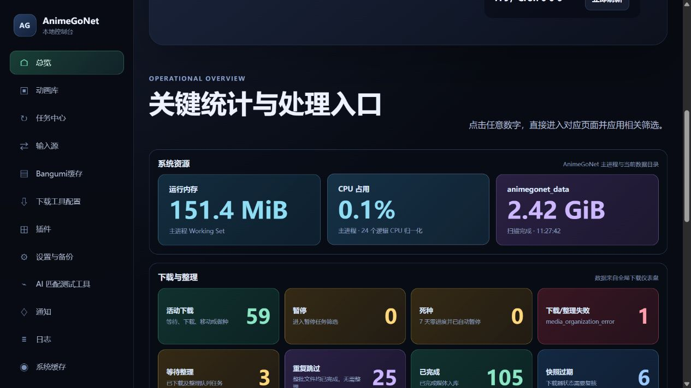
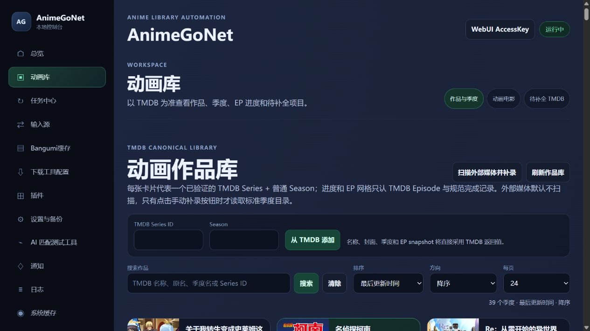
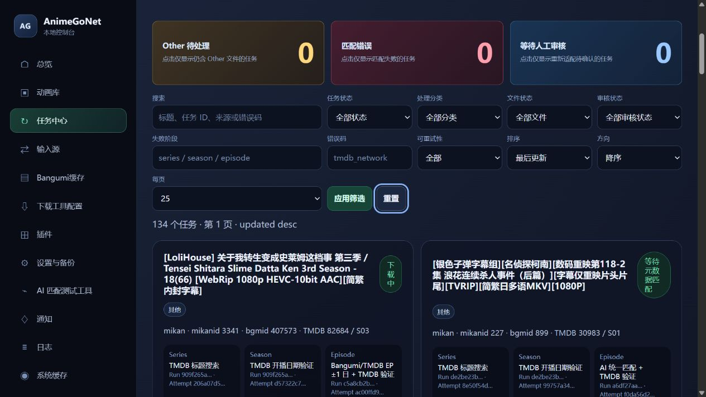
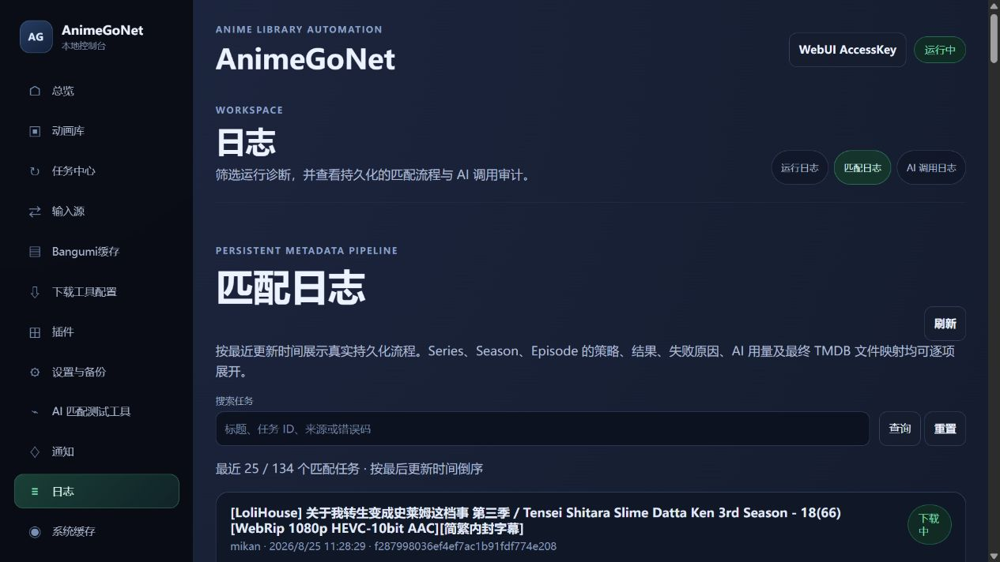

# AnimeGoNet

AnimeGoNet 是 `wetor/AnimeGo develop` 业务行为的 .NET 10 / NativeAOT
移植。主程序使用 ASP.NET Core Minimal API、SQLite 显式 SQL 和静态
TypeScript/HTML/CSS WebUI；首版下载器只支持 qBittorrent，可配置多个命名实例。
Mikan 提供 RSS、手动导入和 AnimeGoHelper；U2 提供 `inner_plugin_u2` 专用手动导入
API 与 AnimeGoHelper 油猴脚本，不包含 U2 RSS 或站点自动抓取。Python 插件已移除，
官方插件均为编译期注册的 C# 实现。

当前开发基线和未完成项以 [TODO.md](TODO.md) 为准，上游逐项映射见
[docs/PORTING_CHECKLIST.md](docs/PORTING_CHECKLIST.md)。
本机私有 Mikan/qB 真实链路的显式验收方法见
[docs/MIKAN_LIVE_INTEGRATION.md](docs/MIKAN_LIVE_INTEGRATION.md)。

## 本机启动

需要 .NET SDK 10.0.300 或同一 feature band：

```powershell
dotnet restore AnimeGoNet.slnx
dotnet run --project src/AnimeGoNet.App -- `
  --data_path E:\AnimeGoNet\data `
  --download_path E:\AnimeGoNet\download `
  --save_path E:\AnimeGoNet\library `
  --movie_save_path E:\AnimeGoNet\movies
```

原生程序默认只监听 `http://127.0.0.1:7991`。可用 YAML `web.host` / `web.port`、
兼容变量 `ANIMEGO_WEB_HOST` / `ANIMEGO_WEB_PORT` 修改；标准 ASP.NET Core
`--urls` / `ASPNETCORE_URLS` 的优先级最高。

首次启动会在 `data_path/animego.yaml` 原子生成带注释的部署配置。也可显式指定：

```powershell
dotnet run --project src/AnimeGoNet.App -- --config E:\AnimeGoNet\animego.yaml
```

配置优先级为命令行/环境变量高于部署 YAML；WebUI 的安全私有覆盖低于被标记为
环境锁的字段。旧 `1.1.0`–`1.7.1` qBittorrent YAML 默认先保存原字节备份，再
原子升级为规范 1.7.1；旧 Transmission 配置保持原文件并 fail closed，必须先
人工迁移到 qBittorrent，绝不会静默改成默认实例。

部署 YAML 支持：

- `paths`：`data_path`、`download_path`、TV `save_path`、电影 `movie_save_path`
- `web`：监听 host/port、Access Key 和后台 worker 开关
- `downloaders.<id>`：qB WebUI 地址、用户名、密码、下载路径和启停
- `sources.<id>`：adapter、下载器绑定、文件策略、Torrent Host 白名单、
  category/tags、做种时间和 RSS 规则开关
- `metadata`：TMDB/Bangumi API 地址与代理、P4–P1 季度失败链、Bangumi 最终
  兜底、可信 offset、统一 AI 配置
- `torrent_fetch`、`schedule`、`data_update`

部署配置的详细边界见
[docs/DEPLOYMENT_CONFIGURATION.md](docs/DEPLOYMENT_CONFIGURATION.md)。

## WebUI 预览

| 运行总览 | 动画作品库 |
|---|---|
|  |  |

| 匹配与整理任务 | 持久化匹配日志 |
|---|---|
|  |  |

## Docker

正式版本的 amd64/arm64 镜像发布在 GHCR：

```powershell
docker pull ghcr.io/deqxj00/animegonet:latest
```

也可使用 `latest`、主次版本标签，或按 Actions 输出的不可变 `sha256` digest 固定部署；
来源证明验证命令见 [CI / NativeAOT / Docker](docs/CI_CD.md)。

下面是只运行 AnimeGoNet、不包含 qBittorrent 的最小 `compose.yaml`。首次启动后，在
WebUI 的“下载工具配置”中添加已有的本机、NAS 或远程 qBittorrent 实例即可。

```yaml
services:
  animegonet:
    image: ${ANIMEGONET_IMAGE:-ghcr.io/deqxj00/animegonet:latest}
    container_name: animegonet
    restart: unless-stopped
    user: "${PUID:-1000}:${PGID:-1000}"
    read_only: true
    tmpfs:
      - /tmp
    environment:
      ASPNETCORE_ENVIRONMENT: Container
      DOTNET_RUNNING_IN_CONTAINER: "true"
      TZ: ${TZ:-Asia/Shanghai}
      inner_plugin_mikan__access_key: ${ANIMEGONET_ACCESS_KEY:-123456}
      inner_plugin_u2__access_key: ${ANIMEGONET_U2_ACCESS_KEY:-123456}
      webui_access_key: ${ANIMEGONET_WEBUI_ACCESS_KEY:-}
      data_path: /data
      download_path: /download/incomplete
      save_path: /download/anime
      movie_save_path: /download/movies
      background_workers_enabled: ${ANIMEGONET_BACKGROUND_WORKERS_ENABLED:-true}
    ports:
      - "${ANIMEGONET_BIND_ADDRESS:-127.0.0.1}:${ANIMEGONET_PORT:-7991}:7991"
    volumes:
      - type: bind
        source: ${ANIMEGONET_DATA_ROOT:-./data}
        target: /data
      - type: bind
        source: ${ANIMEGONET_DOWNLOAD_ROOT:-./download_temp}
        target: /download/incomplete
      - type: bind
        source: ${ANIMEGONET_TV_ROOT:-./jellyfin_tv_data}
        target: /download/anime
      - type: bind
        source: ${ANIMEGONET_MOVIE_ROOT:-./jellyfin_movie_data}
        target: /download/movies
    security_opt:
      - no-new-privileges:true
```

```powershell
docker compose up -d
```

请先创建四个宿主目录，并确保 `PUID:PGID` 对它们有读写权限。外部 qBittorrent 的
完成目录必须与 `ANIMEGONET_DOWNLOAD_ROOT` 指向同一份共享存储；两边容器路径不同
时，在下载器配置中填写对应的路径映射。

### Docker 参数

Compose 示例直接支持以下启动参数：

| 参数 | 默认值 | 用途 |
|---|---|---|
| `ANIMEGONET_IMAGE` | `ghcr.io/deqxj00/animegonet:latest` | 镜像标签或带 digest 的完整镜像地址 |
| `ANIMEGONET_BIND_ADDRESS` | `127.0.0.1` | 宿主监听地址；需要局域网访问时改为 `0.0.0.0` |
| `ANIMEGONET_PORT` | `7991` | 宿主 WebUI 端口 |
| `PUID` / `PGID` | `1000` / `1000` | 容器进程及挂载目录使用的 Unix UID/GID |
| `TZ` | `Asia/Shanghai` | 容器时区 |
| `ANIMEGONET_DATA_ROOT` | `./data` | SQLite、配置、缓存、日志和备份目录 |
| `ANIMEGONET_DOWNLOAD_ROOT` | `./download_temp` | qBittorrent 与 AnimeGoNet 共享的下载目录 |
| `ANIMEGONET_TV_ROOT` | `./jellyfin_tv_data` | TV 整理目标目录 |
| `ANIMEGONET_MOVIE_ROOT` | `./jellyfin_movie_data` | Movie 整理目标目录 |
| `ANIMEGONET_ACCESS_KEY` | `123456` | AnimeGoHelper (Mikan) 内部插件 API 密钥；公网部署必须修改 |
| `ANIMEGONET_U2_ACCESS_KEY` | `123456` | `inner_plugin_u2` 专用 API 密钥；公网部署必须修改 |
| `ANIMEGONET_WEBUI_ACCESS_KEY` | 空 | 独立 WebUI 密钥；空值表示不启用 WebUI 鉴权 |
| `ANIMEGONET_BACKGROUND_WORKERS_ENABLED` | `true` | 是否运行 RSS、下载、匹配和整理后台 Worker |

容器还接受以下常用应用配置。它们可加入 `environment`；嵌套配置统一使用 .NET
双下划线格式，例如 `downloaders__bt__base_url`：

| 参数 | 用途 |
|---|---|
| `ANIMEGO_CONFIG` | 指定配置文件，容器内通常为 `/data/animego.yaml` |
| `ANIMEGO_DEBUG` | 启用 Debug 控制台和文件日志 |
| `ANIMEGO_WEB` | 是否启动 WebUI；设为 `false` 时仍可运行后台 Worker |
| `ANIMEGO_CONFIG_BACKUP` | 启动时执行配置备份 |
| `ANIMEGO_WEB_HOST` / `ANIMEGO_WEB_PORT` | 修改容器内部监听地址和端口；同时要调整 Compose 的端口映射 |
| `outbound_proxy_url` / `outbound_proxy_hosts` | 统一 HTTP/SOCKS5 代理及允许走代理的域名/通配符列表 |
| `mikan_base_url` | Mikan API/页面基础地址 |
| `bangumi_base_url` | Bangumi API 基础地址 |
| `tmdb_base_url` / `tmdb_image_base_url` | TMDB API 与图片基础地址 |
| `tmdb_api_key` | TMDB API Key |
| `ai_base_url` / `ai_api_key` / `ai_model` | AI API 地址、密钥与模型 |
| `ai_reasoning_effort` | AI 推理程度 |
| `ai_tmdb_mcp_url` / `ai_bangumi_mcp_url` | TMDB/Bangumi MCP 地址 |
| `sources__mikan__mikan_identity_cookie` | Mikan Identity Cookie 中 `.AspNetCore.Identity.Application=` 后的内容 |
| `downloaders__bt__base_url` | qBittorrent Web API 地址 |
| `downloaders__bt__username` / `downloaders__bt__password` | qBittorrent 用户名和密码 |
| `downloaders__bt__download_path` | qBittorrent 看到的下载路径 |
| `downloaders__bt__enabled` | 是否启用该 qBittorrent 实例 |

所有 YAML 嵌套键均可按 `父级__子级__字段` 形式覆盖。完整优先级、兼容别名、代理、
下载器和敏感字段说明见
[部署配置文档](docs/DEPLOYMENT_CONFIGURATION.md)。密码、Cookie、API Key 和
passkey URL 建议放入未提交的 `.env` 或 Docker secrets，不要直接写进 Compose。

来源配置中的四种文件策略可在 WebUI 修改：`move` 下载后立即移动且不做种；`link`
立即发布并保留做种源，可选择同文件系统的硬链接（默认）或可跨文件系统的软链接；
`link_delete` 固定使用硬链接，做种到期并复核后删除下载源；`wait_move` 做种到期后才移动。
Docker 使用软链接时，AnimeGoNet 与 Jellyfin 必须以兼容的容器路径同时挂载下载源和媒体库，
否则 Jellyfin 虽能看到链接文件却无法解析其目标。完整语义见
[输入源与下载路由](docs/SOURCE_ROUTING.md)。

容器内部固定路径为：

- `data_path=/data`
- `download_path=/download/incomplete`
- `save_path=/download/anime`
- `movie_save_path=/download/movies`

首次启动生成的 `/data/animego.yaml`、SQLite 和私有配置都会持久化到
`ANIMEGONET_DATA_ROOT`。内部插件 API Access Key 与 WebUI Access Key 相互独立。

仓库还保留带两台 qBittorrent 的完整开发 Compose，以及显式环境变量形式的
[`docker-compose.external-qbittorrent.yml`](docker-compose.external-qbittorrent.yml)。
跨容器路径配置见[外部 qBittorrent 路径映射文档](docs/EXTERNAL_QBITTORRENT.md)。

## 测试

```powershell
dotnet test AnimeGoNet.slnx -c Release
```

本机 portable qBittorrent 测试默认只读；显式安全写入验收使用：

```powershell
./eng/qbittorrent-local-integration.ps1 -DispatchFixture
```

该测试只使用仓库内 5 字节、无可用 tracker 的固定 Torrent，并在结束时精确清理。
完整边界见
[docs/LOCAL_QBITTORRENT_INTEGRATION.md](docs/LOCAL_QBITTORRENT_INTEGRATION.md)。

NativeAOT 与容器 CI 覆盖 `win-x64`、`win-arm64`、`linux-x64`、
`linux-arm64`、`osx-arm64`，Docker 构建覆盖 amd64/arm64。

## 主要文档

- [用户迁移手册](docs/USER_MIGRATION.md)
- [运维、备份与恢复](docs/OPERATIONS.md)
- [外部 C# 插件安装与回滚](docs/PLUGIN_OPERATIONS.md)
- [架构与 NativeAOT 边界](docs/ARCHITECTURE.md)
- [统一输入与来源路由](docs/SOURCE_ROUTING.md)
- [TMDB/Bangumi/AI 元数据流程](docs/METADATA_RESOLUTION.md)
- [OpenAPI 契约](docs/API_OPENAPI.md)
- [WebUI](docs/WEB_UI.md)
- [外部 qBittorrent 部署](docs/EXTERNAL_QBITTORRENT.md)
- [CI / NativeAOT / Docker](docs/CI_CD.md)
- [首版实现完成审计](docs/IMPLEMENTATION_COMPLETION_AUDIT.md)
