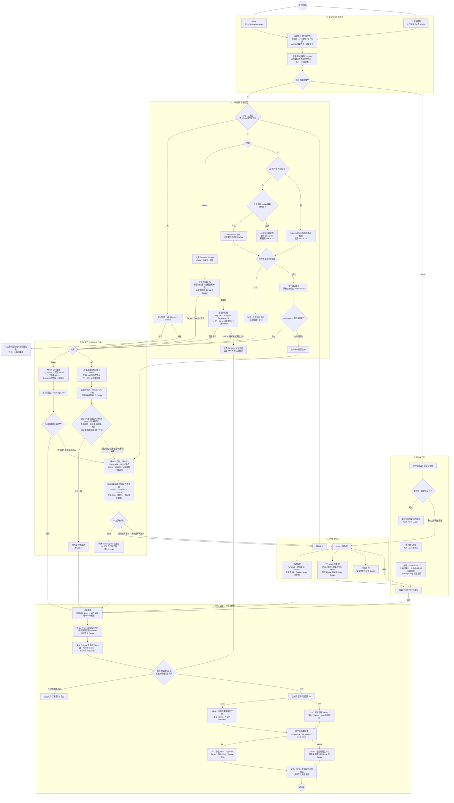

# AnimeGoNet 匹配与整理流程图

下图按当前实现说明从 Mikan/U2 输入开始，经过作品、季度、Episode、AI、
全局去重、下载和文件整理，最终写入动画库完成记录的主要流程。

## 关键规则

- U2 的 `TV` / `Movie` 完全采用油猴插件传入值，后端不根据标题改写类型。
- U2 TV 只有整个 Torrent 的普通正片 EP 与 TMDB 普通季度完全一致时才跳过 AI；
  一旦进入 AI，本地解析结果不再作为最终答案。
- U2 完整下载种子内容，包括 Extras 和 `.pad`；`.pad` 只在匹配时忽略。
- 人工/可信 EP Offset 只适用于 Mikan；Mikan 也可以按文件跳过已经完成的 Episode。
- AI 只提供候选，程序仍会重新验证 TMDB Series、Season 和 Episode，并拒绝
  Season 0、身份不一致及重复目标。
- Extras 不占普通 Episode，也不计入 Other 提醒；无法确认的普通视频才进入 Other。
- 只有下载、链接或移动、NFO 与数据库写入全部成功，才创建动画库完成记录。

